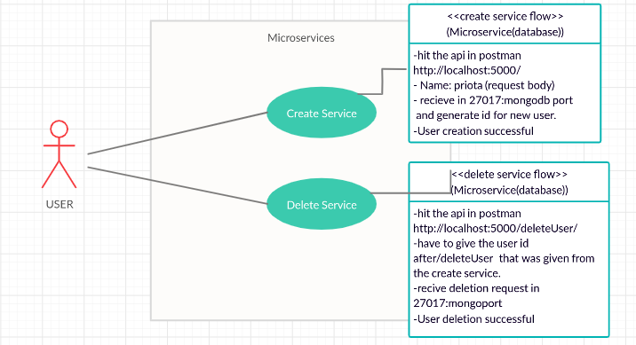
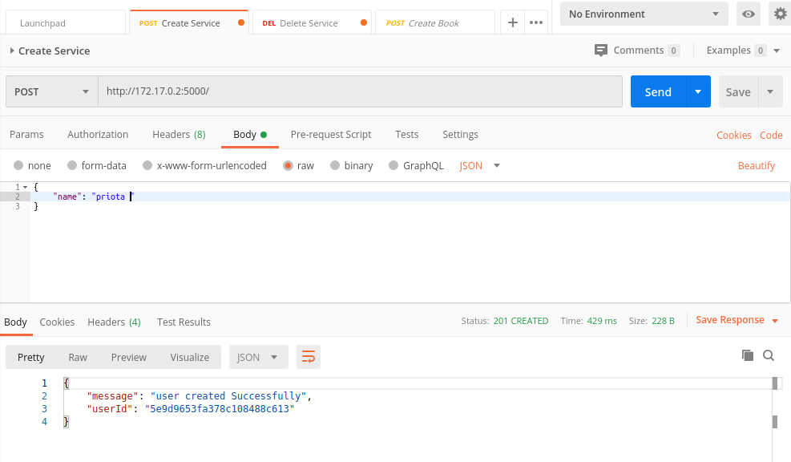
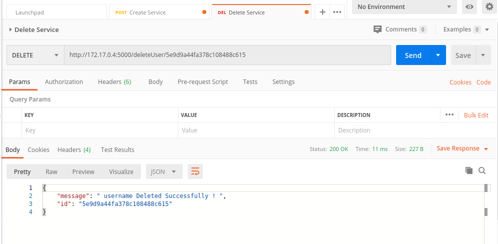

# Microservices
##### Here i make simple two microservices that one will create the user and another can delete it.
___

Here I use :
* mongodb
* python flask
* docker
* postman
* gunicorn
___

here is the use case diagram of this system: 
   
___
  here "local host" will be replace with the ip of docker like this url for creation in postman:
  
  
___
 here is the url for deletion in postman:
 
___

##### Install Docker, if you don't already have it, then add a Dockerfile to the root directory:
Build the image :
###### $ docker-compose build

you can edit docker-composer.yml file with your port or any required settings for composing here. 

or you can simply run docker-compose if you have composed already
###### $ docker-compose up -d 

Then you will see some green signals that make sure that your composing containers are running well !! :D 
Then you can shut your composing down by this command :
###### $ docker-compose down

___
